# Movie Book Library — Internship Project Report

## 1. Cover Page

**Movie Book Library**
Full Stack Web Application (React + Node.js + Express + MongoDB Atlas)

Internship Project Report submitted for final evaluation.

**Organization:** Naviotech Solution Pvt Ltd

**Team:**
Arun Kumar Jain — Backend Developer & Integration Engineer
Ansh — Frontend Developer
Jheel — Documentation & Project Delivery

**Contributions:**
Arun Kumar Jain — Node.js + Express backend; MongoDB integration; CRUD, search, filter and pagination APIs; backend testing; frontend–backend integration; deployment support; final integration and release.
Ansh — React frontend and UI design; forms and validation; movie/book cards; Edit/Delete UI; search and filter interface; frontend bug fixes; frontend deployment support.
Jheel — project report; PPT preparation; architecture diagrams; screenshots organization; README preparation; final and deployment documentation; submission package.

**Live deployment:** frontend `https://movie-book-library-1.onrender.com` (Render Static Site) · backend `https://movie-book-library-ii96.onrender.com` (Render Web Service) · MongoDB Atlas.

**Technologies:** React.js, Vite, CSS, Node.js, Express.js, Mongoose, MongoDB Atlas

Place: ______________  Date: ______________

## 2. Certificate Placeholder

CERTIFICATE

This is to certify that the project entitled **"Movie Book Library — Full Stack Web Application"** is a bonafide record of internship project work carried out by **Arun Kumar Jain, Ansh and Jheel** in partial fulfilment of the requirements for the internship program at **Naviotech Solution Pvt Ltd**.

The work embodies the results of original study and implementation carried out by the team under supervision, and to the best of our knowledge has not been submitted for any other evaluation.

Guide Name: ______________  Signature: ______________  Date: ______________

HOD / Mentor: ______________  Signature: ______________  Date: ______________

Company Seal: ______________

## 3. Acknowledgement

We sincerely thank Naviotech Solution Pvt Ltd for the internship opportunity and for evaluating this project. We thank our mentors for guidance on full-stack architecture, REST API design and database modelling.

Arun Kumar Jain designed and implemented the backend, the MongoDB Atlas integration, the REST APIs and the frontend–backend integration. Ansh designed and implemented the React frontend and the complete UI. Jheel produced the documentation, this report, the presentation and the final project packaging. We also acknowledge the open documentation of React, Vite, Express, Mongoose and MongoDB, and the VS Code and MongoDB Compass tools used during testing.

## 4. Declaration

We, Arun Kumar Jain, Ansh and Jheel, hereby declare that the project entitled "Movie Book Library" submitted for internship evaluation at Naviotech Solution Pvt Ltd is an original work carried out by our team. All features, code, test results and screenshots presented in this report are from the actual implemented project. No feature has been invented for this report, and third-party content is limited to the open-source libraries listed in the Technology Stack section.

Arun Kumar Jain: ______________  Ansh: ______________  Jheel: ______________  Date: ______________

## 5. Abstract

The Movie Book Library is a full-stack web application for managing a personal collection of movies and books. The frontend is a React + Vite single-page application with a responsive dark card UI. The backend is a Node.js + Express REST API using Mongoose for validation, persisted in MongoDB Atlas (database `movie`, collection `items`). The system implements complete CRUD (add, view, edit, delete), case-insensitive search, genre/type/rating filters, newest/oldest/top-rated sorting and server-side pagination. A field-alias contract (`runtime` = `runtimeOrPages`, `director` = `directorOrAuthor`) lets the UI consume the API with no mapping layer, and a shared 1–5 rating scale runs from form input through validation to display. Verification included a clean production build, lint with zero errors, a 20-check live API suite against Atlas (all passing), manual UI testing and database confirmation in MongoDB Compass. The release is deployed and live: frontend `https://movie-book-library-1.onrender.com` (Render Static Site) backed by `https://movie-book-library-ii96.onrender.com` (Render Web Service); see §24 Deployment and Release.

## 6. Introduction

Personal media collections quickly outgrow notes and spreadsheets: titles, posters, genres, ratings, directors and runtimes scatter across apps, and searching them is painful. The Movie Book Library centralizes movies and books in one searchable, filterable, persistent web library.

The system stores both media kinds in a single `Item` collection distinguished by a `type` field (`Movie`/`Book`). The React frontend renders poster cards with type badges and star ratings, and drives every data operation through five REST endpoints. The Express backend validates each write with Mongoose, translates UI controls into MongoDB queries (regex search, exact and range filters, sorting, skip/limit pagination), and returns a consistent JSON envelope. This report documents the architecture, implementation, verification and results of the completed project.

## 7. Problem Statement

1. Movie and book records are scattered across notes, files and streaming apps, with no single searchable store.
2. Manual lists offer no combined type handling, no range filtering on ratings, and no sorting or pagination.
3. Unvalidated data entry produces inconsistent records (missing titles, out-of-range ratings, wrong types).
4. A usable solution must be persistent (cloud database), validated (schema), accessible (web UI) and demonstrably tested.

Success criteria for this project: full CRUD over REST; search by title/director; genre, type and rating filters; three sort orders; server-side pagination; a shared 1–5 rating scale; responsive UI with loading/error/empty states; Atlas persistence provable in Compass.

## 8. Objectives

1. Implement complete CRUD for movies and books through REST endpoints.
2. Implement case-insensitive search across titles and director/author names.
3. Implement genre, type and rating (greater-than-or-equal) filters.
4. Implement newest-first, oldest-first and top-rated sorting.
5. Implement server-side pagination (4 cards per page in the UI).
6. Enforce a shared 1–5 rating scale from form input through API validation to display.
7. Provide loading, error-with-retry, empty-library and no-results UI states.
8. Achieve a zero-mapping frontend↔backend field contract via response aliases.
9. Verify with build, lint, live API tests and database inspection.
10. Deliver evaluation-ready documentation, report and presentation.

## 9. Scope of Project

In scope: all features listed in §8; single shared collection; URL-based posters; cloud persistence on MongoDB Atlas; documentation and demo pack. Out of scope (see §21): user accounts and authentication, per-user collections, image uploads, reviews, offline support and automated test suites. Assumptions: backend runs on port 5000, frontend on port 5173, Atlas reachable over the internet, posters supplied as direct image URLs.

## 10. System Architecture

The system follows a three-tier architecture. The browser runs the React SPA (`Library.jsx` data layer + `AddItemForm.jsx` modal), which communicates over HTTP with the Express API mounted at `/api/items`. Controllers translate query parameters into Mongoose/MongoDB operations; Mongoose validates writes against the `Item` schema before persisting to Atlas (`movie.items`). The API is stateless and JSON-only; CORS is enabled for the Vite dev server.

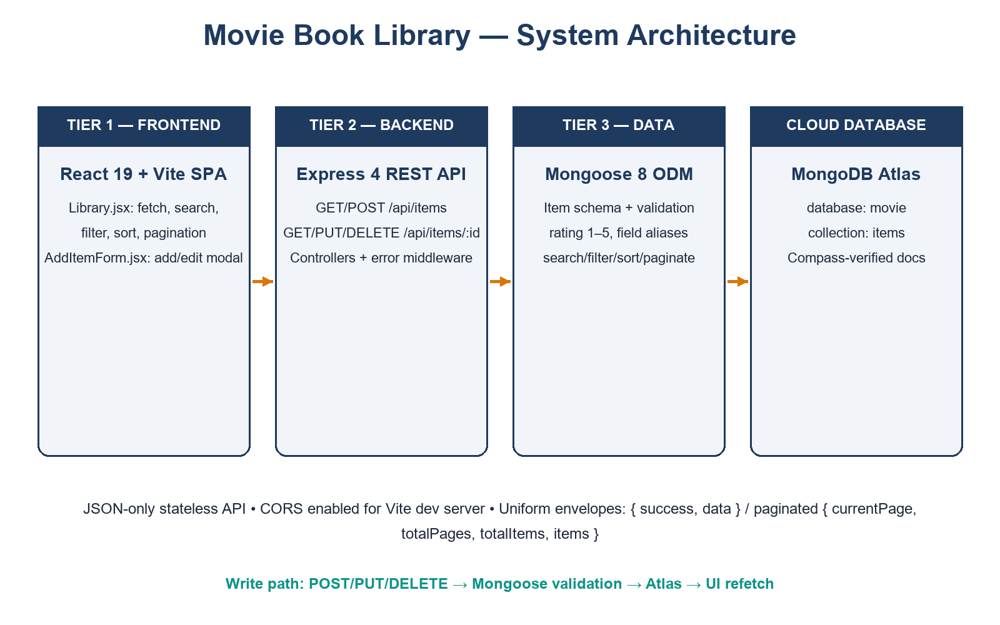

A typical filter interaction flows as follows: a filter change rebuilds the query string (search input is debounced 350 ms) → `GET /api/items?...` → the controller builds a MongoDB filter, sort and skip/limit → paginated JSON returns → cards re-render. Mutations (`POST`/`PUT`/`DELETE`) refetch the list afterwards so the UI always reflects the database.

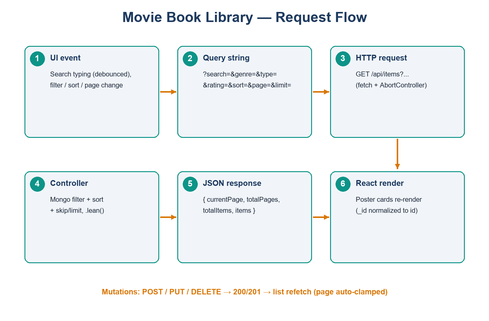

## 11. Technology Stack

| Layer | Technology | Version (from package.json) | Role |
|-------|-----------|-----------------------------|------|
| Frontend | React + React DOM | ^19.2.8 | Component UI, state, effects |
| Frontend | Vite | ^8.3.0 | Dev server, production build |
| Frontend | CSS | — | Custom responsive dark theme |
| Backend | Node.js | runtime | JavaScript server runtime |
| Backend | Express.js | ^4.19.2 | Routing, middleware, JSON API |
| Backend | Mongoose | ^8.5.0 | Schema, validation, Atlas ODM |
| Database | MongoDB Atlas | cloud | Database `movie`, collection `items` |
| Test tools | VS Code REST client, MongoDB Compass, oxlint | — | API testing, DB inspection, lint |

Environment configuration: `server/.env` provides `MONGO_URI` and `PORT`; `client/.env` optionally provides `VITE_API_URL` (default `http://localhost:5000/api/items`).

## 12. Frontend Development

`client/src/pages/Library.jsx` owns the data layer. `API_BASE_URL` defaults to the local backend with a `VITE_API_URL` override. A `URLSearchParams` builder maps UI controls to `?search=&genre=&type=&rating=&sort=&page=&limit=` (limit 4 preserves the 4-per-page grid). Search input is debounced 350 ms; requests use `AbortController` so fast typing never renders stale pages. Fetched documents are normalized once (`_id` → `id`) so keys, edit, delete and the details modal share one identifier. A sanitizer strips empty `year` strings (the backend stores `year` as a Number) and read-only keys before `POST`/`PUT`. Server-supplied `totalPages`/`totalItems` drive pagination and the empty/no-results states; a clamp effect keeps the page in range after deletions.

`client/src/components/AddItemForm.jsx` implements the Add/Edit modal. Every field is coerced with `String()` on prefill and on submit, so numeric values arriving from MongoDB (`year`, `rating`) can never crash `.trim()` calls. The update path resolves `_id || id` with a missing-ID guard. A live poster preview reports loading/success/error states. Styling lives entirely in the existing `App.css`; Edit, Delete and View Details controls are preserved.

## 13. Backend Development

`server/server.js` wires CORS, JSON parsing, the `/api/items` router, a 404 handler and centralized error middleware. `server/routes/itemRoutes.js` exposes the five endpoints with unchanged paths. `server/controllers/itemController.js` implements `createItem`, `getAllItems`, `getItemById`, `updateItem` and `deleteItem` with async/await and try/catch throughout. Two compatibility helpers implement the UI contract: `normalizeItemInput` maps `runtime` → `runtimeOrPages` and `director` → `directorOrAuthor` on writes (canonical names win when both are sent), and `withCompatibilityFields` adds `runtime`/`director` mirrors to every read payload. List queries use `.lean()` with MongoDB regex search, exact genre/type matching, `rating: { $gte }` filtering, three sort orders and skip/limit pagination capped at 50. `server/middleware/errorHandler.js` maps CastError to 400, ValidationError to 400, duplicate-key 11000 to 400, and anything else to 500 with a uniform `{ success: false, message }` shape.

## 14. Database Design

Database **`movie`**, collection **`items`** (Mongoose model `Item`, pluralized). One document per movie/book:

| Field | Type | Constraint |
|-------|------|-----------|
| `title` | String | required, trimmed |
| `type` | String | required, enum `Movie`/`Book` |
| `genre` | String | required |
| `rating` | Number | required, min 1, max 5 |
| `poster` | String | optional URL, trimmed |
| `year` | Number | optional |
| `directorOrAuthor` | String | optional |
| `runtimeOrPages` | String | optional |
| `description` | String | optional |
| `createdAt` / `updatedAt` | Date | automatic timestamps |
| `_id` / `__v` | ObjectId / Number | MongoDB/Mongoose managed |

Only the default `_id` index is used (see the Indexes tab in the figure).

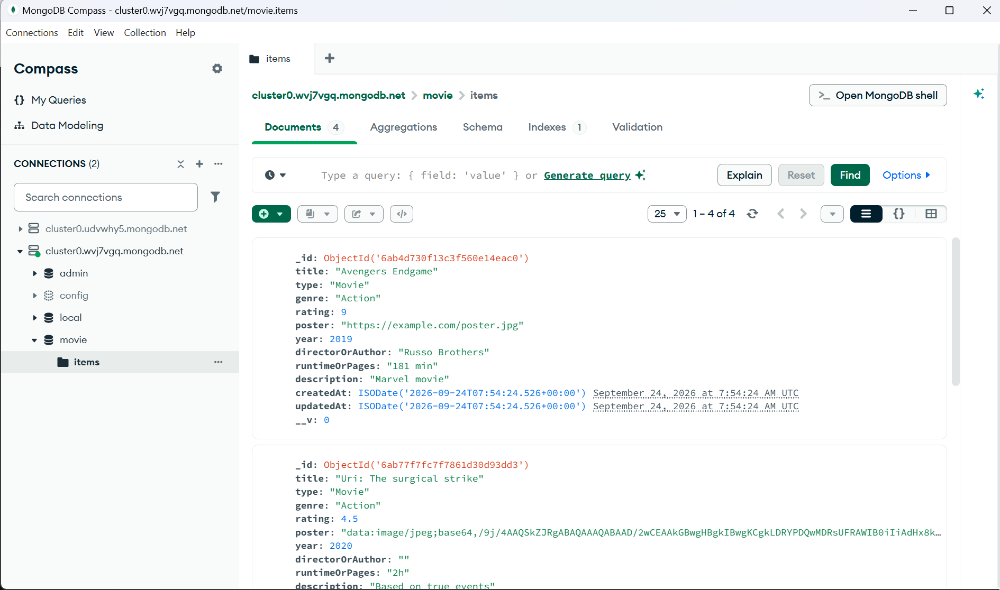

## 15. API Design

| Method | Endpoint | Success | Errors |
|--------|----------|---------|--------|
| POST | `/api/items` | 201 + created document | 400 validation |
| GET | `/api/items` | 200 + paginated envelope | 400 bad filter value |
| GET | `/api/items/:id` | 200 + document | 400 invalid id, 404 missing |
| PUT | `/api/items/:id` | 200 + updated document | 400/404 as above |
| DELETE | `/api/items/:id` | 200 + deleted document | 400/404 as above |

List envelope: `{ success, currentPage, totalPages, totalItems, count, items, data }` where `data` mirrors `items`. Single-item responses use `{ success, data }`; failures use `{ success: false, message }`.

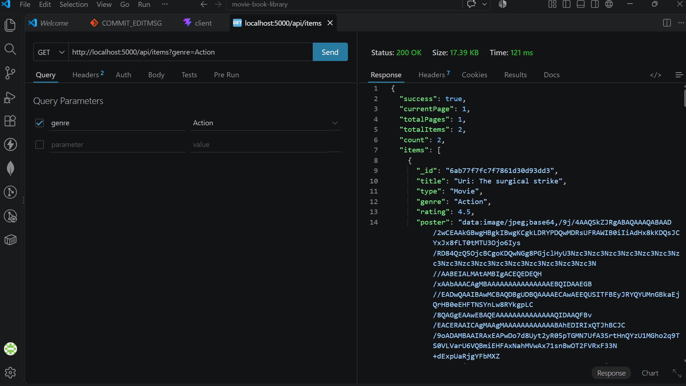

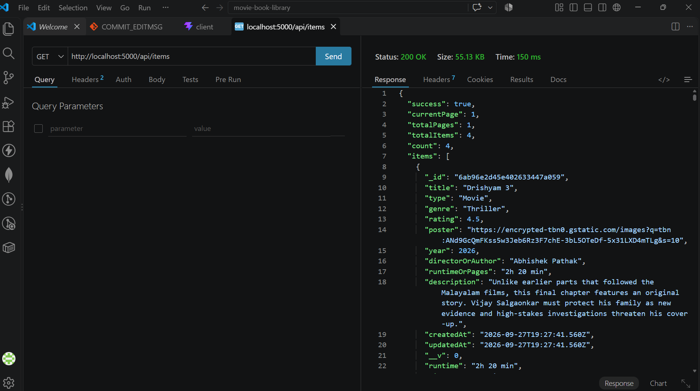

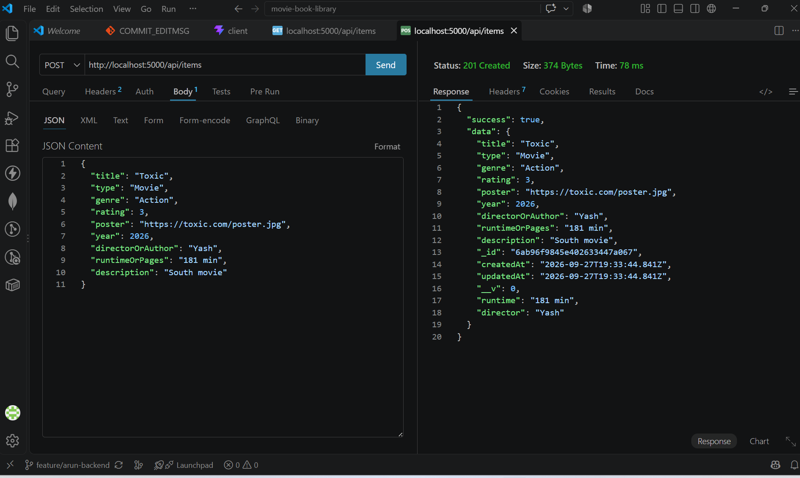

## 16. Features Implemented

| # | Feature | UI control | API mechanism | Proof |
|---|---------|-----------|---------------|-------|
| 1 | Add Movie/Book | Add modal (S08) | POST → 201, refetch newest-first | S06, S08 |
| 2 | View library items | Poster grid (S01, S02) | GET list envelope | S05, S07 |
| 3 | Edit Movie/Book | Edit button → prefilled modal (S07) | PUT → 200, refetch | S07 |
| 4 | Delete Movie/Book | Delete button + confirm (S02) | DELETE → 200, refetch + page clamp | live suite |
| 5 | Search items | Search box, debounced (S01) | `?search=` regex on title + directorOrAuthor | live suite |
| 6 | Filter by genre | Genre dropdown (S09) | `?genre=` exact case-insensitive | S04 |
| 7 | Filter by type | Type dropdown (S09) | `?type=Movie\|Book` | live suite |
| 8 | Filter by rating | Rating dropdown | `?rating=` greater-than-or-equal, 1–5 | live suite |
| 9 | Pagination | Previous/numbered/Next (4 per page) | `?page=&limit=` + totalPages | S05 |
| 10 | Sort by rating (+newest/oldest) | Sort dropdown (S09) | `?sort=rating\|newest\|oldest` | live suite |
| 11 | MongoDB integration | — | Atlas `movie.items` via Mongoose | S03 |
| 12 | REST APIs | — | 5 endpoints, uniform envelopes/codes | S04–S06 |
| 13 | Responsive UI | Dark card layout, modals, states | — | S01, S02 |

## 17. Screenshot Demonstration

### Fig. 17.1 — Homepage with search, filters and library grid

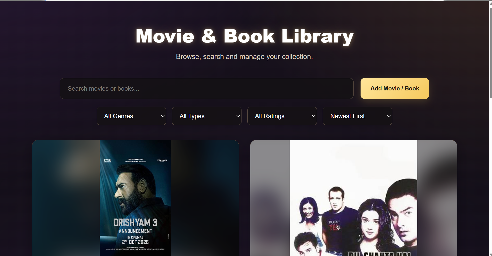

The landing view combines the hero banner, the search input, the Add Movie/Book button and the Genre/Type/Rating/Sort filter row above poster cards rendered from the database.

### Fig. 17.2 — Library cards with actions

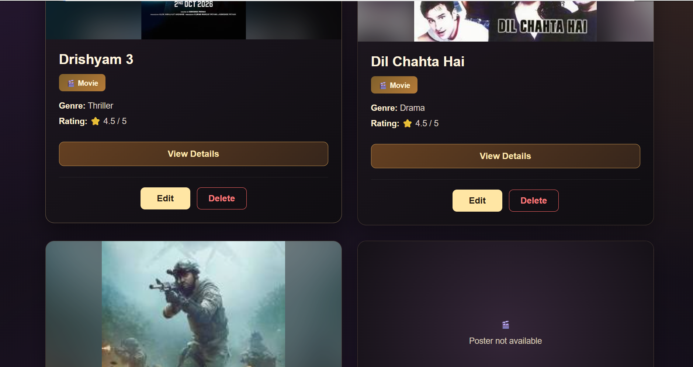

Each card shows the poster (with a placeholder fallback), type badge, genre, star rating out of 5, a View Details button and the preserved Edit/Delete actions.

### Fig. 17.3 — Edit form prefilled from the database

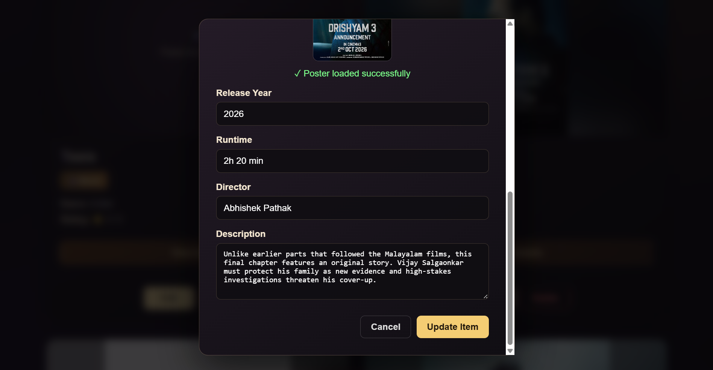

The update modal loads existing values including the poster preview success state and the numeric year, then saves through `PUT /api/items/:id`.

### Fig. 17.4 — Blank Add form

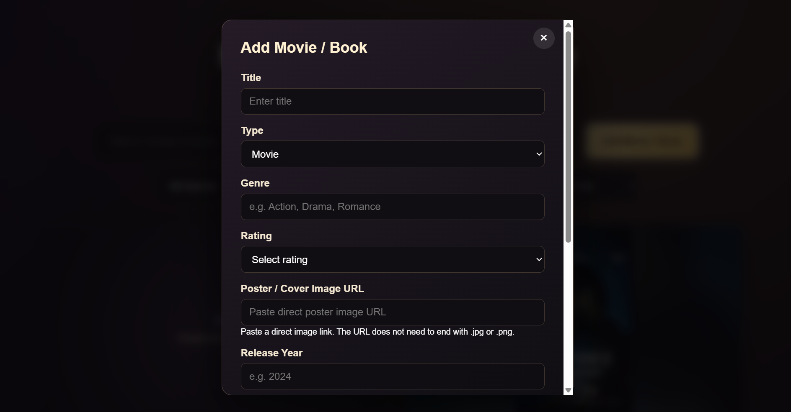

The create form exposes every field — title, type, genre, 1–5 rating, poster URL, release year, runtime, director and description — with required-field validation.

### Fig. 17.5 — Filter bar close-up

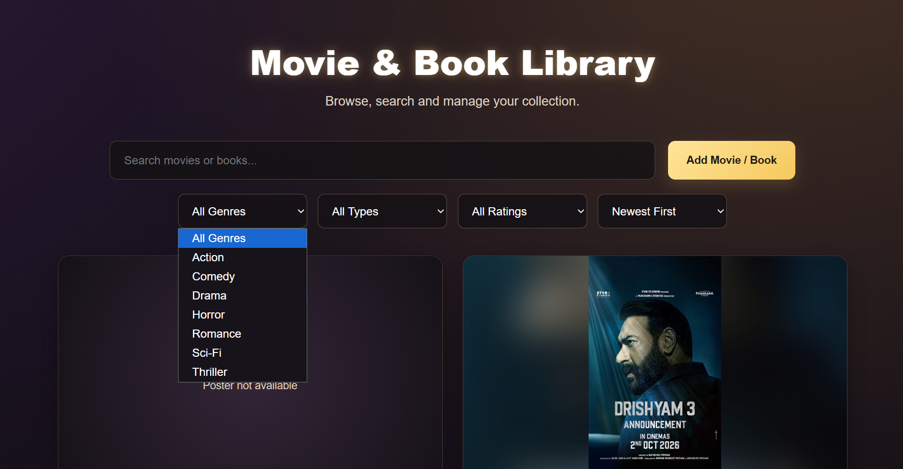

The open genre menu (Action through Thriller) beside the Type, Rating and Sort dropdowns demonstrates the complete filter/sort UI.

## 18. Testing and Validation

| Check | Method | Result |
|-------|--------|--------|
| Production build | `npm run build` (client, Vite) | Pass — 19 modules transformed |
| Lint | `npm run lint` (oxlint) | 0 errors (1 pre-existing informational warning in form prefill effect) |
| Create → read → update → delete round trip | Live Atlas suite | Pass |
| Search (`?search=`) | Live Atlas suite | Pass — finds title and director matches |
| Genre / type / rating filters | Live Atlas suite + S04 | Pass (20/20 API checks, then test docs deleted) |
| Pagination (`?page=&limit=`) and clamping | Live Atlas suite | Pass |
| Sorting (`newest`/`oldest`/`rating`) | Live Atlas suite | Pass |
| Error paths (400 invalid id, 404 missing, 400 validation) | Live Atlas suite | Pass |
| Database persistence | MongoDB Compass inspection | Pass — S03 |
| Manual UI pass (add/edit/delete/search/filters/sort/pages/empty/error-retry) | Browser walkthrough | Pass |

## 19. Challenges Faced

1. **Numeric year crashing the form** (`formData.year.trim is not a function`): MongoDB returns `year` as a Number. Fixed by `String()` coercion on form prefill and submit, plus stripping empty years before POST/PUT.
2. **Divergent field names** (`runtime` vs `runtimeOrPages`, `director` vs `directorOrAuthor`): fixed with backend alias helpers, so the UI needs no mapping layer.
3. **Rating-scale drift** (legacy 1–10-era data vs the 1–5 UI): schema tightened to `max: 5`, rating filter documented as greater-than-or-equal.
4. **Client vs server pagination**: settled on the server contract (`limit=4`, `totalPages`, page clamp) so filtered views stay correct across pages.
5. **Merge conflicts** on both client files when integrating branches: kept the API integration, adopted the details-modal fallbacks and guards, verified with build and lint.

## 20. Results Achieved

All thirteen implemented features work end to end against MongoDB Atlas, and the release is live in production (frontend `https://movie-book-library-1.onrender.com`, backend `https://movie-book-library-ii96.onrender.com`). Writes are validated and aliased in both directions; reads return a stable paginated envelope; the UI covers loading, error-with-retry, empty and no-results states. Quantitatively: 5 REST endpoints, 7 query parameters, 4 cards per page, 20/20 live API checks passing, 0 lint errors, 9 curated screenshots proving each claim.

## 21. Future Enhancements

User accounts with JWT authentication and per-user collections; watchlists and favourites; per-item reviews and comments; poster image upload instead of URL-only posters; shareable filter URLs; progressive-web-app offline support; automated unit/integration suites with a CI pipeline.

## 22. Conclusion

The Movie Book Library meets every objective in §8: complete CRUD, search, three filters, three sort orders, server-side pagination, a shared 1–5 rating scale, resilient UI states and Atlas persistence — delivered through a clean three-tier architecture with a zero-mapping UI↔API contract, and released live at `https://movie-book-library-1.onrender.com`. The division of work (Arun Kumar Jain: backend, database, APIs, integration and release; Ansh: frontend and UI; Jheel: documentation and packaging) produced an evaluation-ready, extensible full-stack application.

## 24. Deployment and Release

The final release is deployed on Render with MongoDB Atlas as the database; no code changes to CRUD logic, UI or schema were required for release.

| Layer | Platform | URL |
|-------|----------|-----|
| Frontend | Render Static Site (Vite production build) | `https://movie-book-library-1.onrender.com` |
| Backend | Render Web Service (Node + Express, `npm start`) | `https://movie-book-library-ii96.onrender.com` |
| Database | MongoDB Atlas | database `movie`, collection `items` |

Production workflow: the deployed frontend is built with `VITE_API_URL=https://movie-book-library-ii96.onrender.com/api/items`, so every search, filter, sort, page and CRUD action runs against production data; the API's open CORS policy accepts the static site without extra configuration, and `PORT` is injected by Render. Release verification: backend health endpoint returns `{"success": true, "message": "Movie & Book Library API is running"}`; the frontend shell loads successfully; CRUD, search, filters, sorting and pagination were validated against the same Atlas cluster pre-release, with test documents removed afterwards.

## 25. References

1. React documentation — react.dev
2. Vite documentation — vite.dev
3. Express.js documentation — expressjs.com
4. Mongoose documentation — mongoosejs.com
5. MongoDB Atlas documentation — mongodb.com/docs/atlas
6. MDN Web Docs — Fetch API, URLSearchParams
7. Project sources — `server/README_BACKEND.md`, `client/.env.example`, repository `package.json` files
